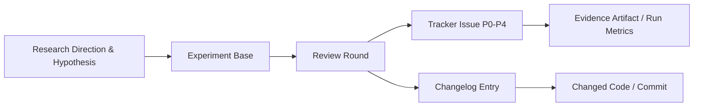

# Universal Research Principles & Experiment Tracking Standards

This document establishes the mandatory scientific methodology, provenance standards, and experiment tracking principles that research projects must follow. These principles ensure that every experiment produces auditable, reproducible, and decision-consequential evidence across any domain (machine learning, reinforcement learning, physics simulations, numerical methods, or speech systems).

---

## 1. Decision Protocol Before Execution

> **Core Rule:** Make every experiment resolve a specific decision. Never run an experiment without a pre-registered protocol.

Before launching an experiment or allocating GPU/CPU compute:

1. **Decision and Value:**
   - Clearly state what engineering or scientific decision the result will change.
   - If the result will not change any action or belief, do not run the experiment.
2. **Hypothesis and Rival Explanation:**
   - Define the predicted observation and the strongest competing rival explanation (e.g., hyperparameter sensitivity, random seed variance, baseline tuning disparity, or initialization confounds).
3. **Smallest Discriminating Test:**
   - Always choose the cheapest discriminating comparison before running large matrices.
   - Prefer mathematical derivation or existing artifact analysis -> then small local diagnostics (CPU/smoke) -> then multi-seed training sweeps.
4. **Pre-specified Effect Thresholds:**
   - Fix primary evaluation metrics and practical effect size thresholds *before* outcome inspection.
   - Do not invent post-hoc ranking criteria or switch from `last_eval` to cherry-picked `best_eval`.
5. **Compute Budget & Resource Caps:**
   - Cap the entire investigation (including hyperparameter sweeps, follow-ups, and diagnostics), not just the first run.
   - Provide historical runtime estimates and hardware concurrency bounds.
6. **Explicit Termination Criteria:**
   - Define explicit criteria to `CONTINUE`, `STOP`, or `REPAIR` an invalid measurement.
   - Negative results must be preserved and honored; a negative result must not trigger endless rescue ablations.
7. **Screening vs. Confirmation:**
   - **2 seeds:** Exploratory screening only. Screens out defective directions. Never confirm a stable advantage with 2 seeds.
   - **5+ seeds:** Required for formal confirmation with reported uncertainty (mean ± SD, confidence bounds, Welch p-values).

---

## 2. Lineage Over Layout: The Experiment-to-Code Graph

> **Core Rule:** Maintain a clear, unbroken line of custody from hypothesis to code changes.



Every project must maintain the four-tier hierarchy:
1. **Experiment (`experiment_NNN`):** One evidence base, research direction, or algorithmic hypothesis.
2. **Review Round (`round_MMM`):** One formal review, evaluation pass, or diagnostic audit on that evidence base.
   - Recorded in `CONTEXT.md` with: Trigger, Focus, What Changed, Evidence Summary, Outcome, and Reviewers.
3. **Issue Tracker (`TRACKER.md`):** Global issue registry across all experiments with strict severity and status tracking.
4. **Code Lineage (`changelog.md`):** Every code change and run milestone must link back to the round or issue that motivated it.

---

## 3. Global Issue Tracker & Severity Taxonomy

All empirical anomalies, baseline flaws, and code defects must be recorded in `reports/reviews/TRACKER.md` using the standard severity classification:

| Severity | Definition | Operational Response |
| :--- | :--- | :--- |
| **P0 (Critical)** | Correctness bug, reward bug, data leakage, broken evaluation loop, or fatal crash. | Blocks all further experimental execution. Immediate fix required. |
| **P1 (Claim/Code Mismatch)** | Paper/hypothesis claim not supported by implementation; baseline protocol disparity; unfair hyperparameter tuning. | Blocks publication and confirmation claims until reconciled. |
| **P2 (Quality & Confound)** | Insufficient seed statistical power; missing negative control; un-isolated confounding variable. | Must be scheduled before claiming superiority. |
| **P3 (Minor)** | Minor discrepancy; un-normalized plot labels; secondary diagnostic omission. | Address during cleanup passes. |
| **P4 (Hygiene)** | Code readability, dead artifact cleanup, comment drift. | Optional cleanup. |

### Issue Lifecycle States:
- `open`: Identified and awaiting action or confirmation.
- `fixed`: Verified resolved by an explicit commit, code patch, or rerun.
- `wontfix`: Deliberately acknowledged as out of scope or structurally bounded.
- `disputed`: Rebutted by counter-evidence or proven to be a non-factor.

---

## 4. Run Provenance, Immutability & Snapshotting

> **Core Rule:** A commit SHA alone does not verify a run. Provenance requires the SHA, worktree cleanliness, environment fingerprint, and frozen configurations.

For every experiment run:
1. **Immutable Configuration Snapshot:**
   - Copy all active configuration files (YAML, JSON, TOML) into a dedicated snapshot folder (`configs_snapshot/`) alongside run metadata before launching.
2. **Git State Verification:**
   - Record exact `base_commit` (`git rev-parse HEAD`).
   - Record `uncommitted_changes` (`git diff --stat`). A dirty worktree invalidates git SHA provenance unless accompanied by an explicit patch.
3. **Git Tracking Branch:**
   - For long-running or distributed experiments, push a snapshot branch (`exp/<project>/<timestamp>`) before execution.
4. **Explicit Status Lifecycle:**
   Every run snapshot transitions through explicit states:
   - `PLANNED`: Protocol defined, awaiting execution.
   - `RUNNING`: Currently executing on hardware.
   - `FULL_RUN`: Successfully completed all planned updates and evaluation quotas.
   - `BUG_RUN`: Terminated prematurely due to a software, device, or numerical defect.
   - `OBJ_TERMINATED`: Stopped early because objective/stopping threshold was decisively reached.
   - `HUMAN_TERMINATED`: Interrupted by researcher intervention.
5. **No Stale In-Flight Runs:**
   - Before launching a new experiment wave, check for previously `RUNNING` jobs and audit their final status.

---

## 5. Evidence Inside the Graph: Zero-Lost-Context

> **Core Rule:** Review surfaces must embed the actual evidence, not vague references or fragile links.

1. **Embedded Previews:**
   - Structured run summaries (`run_summary.json`), telemetry metrics (`metrics.jsonl`), audit logs, and markdown reports must be previewable directly in the tracking surface (`IDEA_GRAPH.html`).
2. **Number-Forward Auditing:**
   - Findings must surface decisive numbers: success rates, return ratios, standard deviations, Welch p-values, step counts, and wall-clock times.
   - Color code metrics responsibly (red for failures or near-zero rates; green for validated returns; blue for issue tracking).
3. **Artifact Integrity:**
   - Never overwrite historical run summaries or delete completed experiment outputs.
   - Index completed runs idempotently; do not rerun finished seeds when backfilling.

---

## 6. Directory Layout Standard

Every compliant research repository should maintain the following layout:

```text
my-research-project/
├── .experiment-tracker.json     # Tracker configuration
├── changelog.md                 # Chronological change and run audit
├── configs/                     # Base experiment configurations
│   ├── env/
│   ├── model/
│   └── training/
├── runs/                        # Run outputs and telemetry
│   └── <algo>/<tag>/
│       ├── run_summary.json     # Final metrics and active parameters
│       ├── metrics.jsonl        # Step-by-step scalars
│       └── metadata.json        # Execution provenance
└── reports/
    └── reviews/
        ├── README.md            # Master Experiments & Rounds Index
        ├── TRACKER.md           # Global Issue Tracker (P0-P4)
        ├── IDEA_GRAPH.html      # Interactive Lineage Explorer (generated)
        ├── IDEA_GRAPH.md        # Static Mermaid Diagram (generated)
        ├── snapshots/           # Pre-run configuration and git snapshots
        │   └── run_YYYYMMDD_HHMMSS/
        │       ├── metadata.json
        │       └── configs_snapshot/
        └── experiments/
            └── experiment_001/
                ├── README.md
                └── round_001/
                    ├── CONTEXT.md       # Round protocol, trigger, focus, outcome
                    ├── review/          # Detailed critique and audit reports
                    └── rebuttals/       # Empirical rebuttals and counter-evidence
```

---

## 7. Verification Checklist for New Research Projects

Before declaring an experiment family complete:
- [ ] Protocol registered in `CONTEXT.md` with pre-specified effect thresholds.
- [ ] Configurations snapshotted and git commit SHA recorded.
- [ ] No unaccounted seeds; all planned conditions reported (including failures).
- [ ] Primary metric is consistent across comparison tables (e.g. `last_eval`).
- [ ] `experiment-tracker validate` passes with 0 errors.
- [ ] `experiment-tracker build` updates the interactive `IDEA_GRAPH.html`.
- [ ] All issues identified in `TRACKER.md` have explicit resolution paths.
