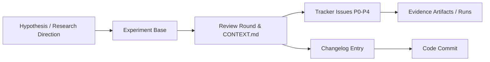

# Research Experiment Tracker

[](https://www.python.org/downloads/)
[](LICENSE)
[]()

A generalized scientific experiment tracking, review lineage, and empirical methodology framework for research projects.

Designed for quantitative researchers, machine learning engineers, and autonomous AI agents who need reproducible, decision-consequential evidence rather than just disconnected metric charts.

---

## 🌟 Why Research Experiment Tracker?

Traditional experiment trackers (e.g., Weights & Biases, MLflow) excel at recording loss curves and scalar metrics. However, they lack the **scientific lineage** required to answer critical research questions:
- *Why* was this experiment launched? What specific hypothesis did it test?
- Which critical bugs (**P0** data leakage, broken reward normalization) invalidate prior runs?
- Which mathematical model, paper claim, or code commit was affected?
- How did review rounds and audits shape the experimental direction?

**Research Experiment Tracker** bridges the gap between **code execution**, **empirical evidence**, and **scientific decisions** by organizing research into an unbroken lineage:



---

## 🚀 Key Features

1. **Interactive Lineage Explorer (`IDEA_GRAPH.html`):**
   - High-performance visual canvas mapping experiments, review rounds, tracker issues, evidence files, and changelogs.
   - Live in-browser preview of Markdown reports, JSON metrics with numerical highlighting, Python source, and run logs.
   - Filter by experiment family, review round, issue severity, or lifecycle status.

2. **Rigorous Scientific Methodology (`PRINCIPLES.md`):**
   - Built-in decision protocol: Pre-register hypotheses, rival explanations, smallest discriminating tests, and stopping criteria.
   - Strict sample size requirements: 2 seeds for screening; 5+ seeds with confidence intervals for confirmation.
   - Standardized P0–P4 severity taxonomy across all empirical findings.

3. **Immutable Run Snapshotting & Provenance:**
   - Pre-run configuration freezing (`configs_snapshot/`) to guarantee exact replayability.
   - Automatic git commit SHA tracking, uncommitted diff stat detection, and optional git tracking branches (`exp/<project>/<timestamp>`).
   - Run lifecycle states: `PLANNED` → `RUNNING` → `FULL_RUN` | `BUG_RUN` | `OBJ_TERMINATED` | `HUMAN_TERMINATED`.

4. **Zero Heavy Dependencies:**
   - Runs out-of-the-box using Python's standard library. No complex database setup, no cloud lock-in.

5. **Universal Portability:**
   - Works across reinforcement learning, computer vision, natural language processing, physics simulations, and numerical ODE/PDE solvers.

---

## 📦 Installation

```bash
git clone https://github.com/qhungbui7/research-experiment-tracker.git
cd research-experiment-tracker
pip install -e .
```

Or copy the `experiment_tracker` package directly into your research repository.

---

## 🛠️ Quickstart

### 1. Scaffold Tracking in Your Project
Navigate to your research repository root and run:
```bash
experiment-tracker init --name "my-research-project"
```
This generates the standardized tracking structure:
```text
my-research-project/
├── .experiment-tracker.json
├── changelog.md
├── configs/
├── runs/
└── reports/
    └── reviews/
        ├── README.md
        ├── TRACKER.md
        └── experiments/
            └── experiment_001/
                └── round_001/
                    └── CONTEXT.md
```

### 2. Snapshot an Experiment Before Running
```bash
experiment-tracker snapshot \
  --description "CartPole POMDP 5-seed sweep with frozen traces" \
  --note "screening gate test" \
  --seeds "0,1,2,3,4"
```

### 3. Finalize the Experiment Upon Completion
```bash
experiment-tracker finalize \
  --run-id "run_20261003_120000" \
  --status FULL_RUN \
  --summary-json "runs/experiment_001/run_summary.json"
```

### 4. Validate Tracking Consistency
```bash
experiment-tracker validate --verbose
```

### 5. Build and Explore the Review Graph
```bash
# Build interactive HTML explorer
experiment-tracker build

# Or launch the live browser dashboard
experiment-tracker serve --port 8080 --open
```

---

## 📖 CLI Command Reference

| Command | Description | Example |
| :--- | :--- | :--- |
| `init` | Scaffold project structure and templates | `experiment-tracker init --name my-proj` |
| `validate` | Verify consistency of tables, files, and issues | `experiment-tracker validate --verbose` |
| `build` | Generate `IDEA_GRAPH.html` or `IDEA_GRAPH.md` | `experiment-tracker build --format html` |
| `snapshot` | Freeze configs and record git state | `experiment-tracker snapshot -d "Ablation test"` |
| `finalize` | Mark run as `FULL_RUN`, `BUG_RUN`, etc. | `experiment-tracker finalize --run-id <id> --status FULL_RUN` |
| `serve` | Serve local web dashboard | `experiment-tracker serve --port 8080` |
| `status` | Display in-flight runs and issue overview | `experiment-tracker status` |

---

## 📚 Core Principles

All compliant research repositories should adhere to the rules in [**`PRINCIPLES.md`**](PRINCIPLES.md):
- **Decision Before Execution:** Define what action changes before spending compute.
- **Lineage Over Layout:** Connect every finding to evidence files and code diffs.
- **Embedded Evidence:** Ensure decisive numbers and metrics are previewable.
- **Auditable Provenance:** Preserve exact commit SHAs and uncommitted worktree diffs.

---

## 📄 License
MIT License. See [LICENSE](LICENSE) for details.
