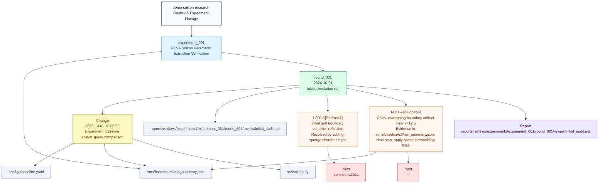

```mermaid
%% Generated by research-experiment-tracker. Do not edit by hand.
flowchart TD
  classDef root fill:#f8fafc,stroke:#334155,stroke-width:2px,color:#0f172a;
  classDef experiment fill:#e0f2fe,stroke:#0284c7,color:#0c4a6e;
  classDef round fill:#dcfce7,stroke:#16a34a,color:#14532d;
  classDef issue fill:#fff7ed,stroke:#ea580c,color:#7c2d12;
  classDef file fill:#f1f5f9,stroke:#64748b,color:#334155;
  classDef report fill:#ede9fe,stroke:#7c3aed,color:#3b0764;
  classDef change fill:#fef9c3,stroke:#ca8a04,color:#713f12;
  classDef next fill:#fee2e2,stroke:#dc2626,color:#7f1d1d;
  classDef run fill:#dcfce7,stroke:#15803d,color:#14532d;
  classDef snapshot fill:#fef3c7,stroke:#d97706,color:#78350f;
  change_2026_10_01_10_00_00__experiment_baseline_soliton_8120ccc3["Change<br/>2026-10-01 10:00:00<br/>Experiment: baseline soliton speed comparison"]
  class change_2026_10_01_10_00_00__experiment_baseline_soliton_8120ccc3 change;
  exp_experiment_001_fc397cff["experiment_001<br/>NCVA Soliton Parameter Extraction Verification"]
  class exp_experiment_001_fc397cff experiment;
  file_configs_baseline_yaml_5cacca6e["configs/baseline.yaml"]
  class file_configs_baseline_yaml_5cacca6e file;
  file_reports_reviews_experiments_experiment_001_round_ed18698c["reports/reviews/experiments/experiment_001/round_001/review/initial_audit.md"]
  class file_reports_reviews_experiments_experiment_001_round_ed18698c file;
  file_runs_baseline_s0_run_summary_json_f4df9bdd["runs/baseline/s0/run_summary.json"]
  class file_runs_baseline_s0_run_summary_json_f4df9bdd file;
  file_src_soliton_py_a15319bb["src/soliton.py"]
  class file_src_soliton_py_a15319bb file;
  issue_i_000__experiment_001__round_001_d13e6f0f["I-000 &#91;P1 fixed&#93;<br/>Initial grid boundary condition reflection<br/>Resolved by adding sponge absorber layer."]
  class issue_i_000__experiment_001__round_001_d13e6f0f issue;
  issue_i_001__experiment_001__round_001_44cb877d["I-001 &#91;P2 open&#93;<br/>Chirp unwrapping boundary artifact near x=12.5<br/>Evidence in runs/baseline/s0/run_summary.json. Next step: apply phase thresholding filter."]
  class issue_i_001__experiment_001__round_001_44cb877d issue;
  next_i_000__commit_4a2b1c_c01c0bf6["Next<br/>commit 4a2b1c"]
  class next_i_000__commit_4a2b1c_c01c0bf6 next;
  next_i_001_9f5852f4["Next<br/>--"]
  class next_i_001_9f5852f4 next;
  report_experiment_001__round_001___reports_reviews_expe_fd8cba40["Report<br/>reports/reviews/experiments/experiment_001/round_001/review/initial_audit.md"]
  class report_experiment_001__round_001___reports_reviews_expe_fd8cba40 report;
  root["demo-soliton-research Review &amp; Experiment Lineage"]
  class root root;
  round_experiment_001__round_001_dad7e967["round_001<br/>2026-10-01<br/>Initial simulation run"]
  class round_experiment_001__round_001_dad7e967 round;
  change_2026_10_01_10_00_00__experiment_baseline_soliton_8120ccc3 --> file_configs_baseline_yaml_5cacca6e
  change_2026_10_01_10_00_00__experiment_baseline_soliton_8120ccc3 --> file_runs_baseline_s0_run_summary_json_f4df9bdd
  change_2026_10_01_10_00_00__experiment_baseline_soliton_8120ccc3 --> file_src_soliton_py_a15319bb
  exp_experiment_001_fc397cff --> file_runs_baseline_s0_run_summary_json_f4df9bdd
  exp_experiment_001_fc397cff --> round_experiment_001__round_001_dad7e967
  issue_i_000__experiment_001__round_001_d13e6f0f --> next_i_000__commit_4a2b1c_c01c0bf6
  issue_i_001__experiment_001__round_001_44cb877d --> file_runs_baseline_s0_run_summary_json_f4df9bdd
  issue_i_001__experiment_001__round_001_44cb877d --> next_i_001_9f5852f4
  root --> exp_experiment_001_fc397cff
  round_experiment_001__round_001_dad7e967 --> change_2026_10_01_10_00_00__experiment_baseline_soliton_8120ccc3
  round_experiment_001__round_001_dad7e967 --> file_reports_reviews_experiments_experiment_001_round_ed18698c
  round_experiment_001__round_001_dad7e967 --> issue_i_000__experiment_001__round_001_d13e6f0f
  round_experiment_001__round_001_dad7e967 --> issue_i_001__experiment_001__round_001_44cb877d
  round_experiment_001__round_001_dad7e967 --> report_experiment_001__round_001___reports_reviews_expe_fd8cba40
```
